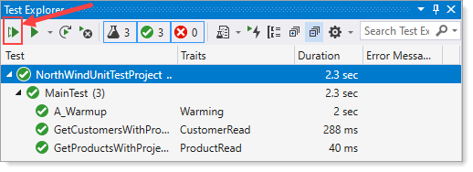

# About

To test working with a SQL-Server attached database. Note connection string is hard-coded, normally the connection string would be in appsettings.json.

## Steps

- Create folder `C:\OED\Dotnetland\VS2019\NorthData`
- Copy `NorthWind2020Local.mdf` and `NorthWind2020Local_log.ldf` to `C:\OED\Dotnetland\VS2019\NorthData`
- Build the solution
- Open Test Explorer and run all three test
  - A_Warmup for waking EF configuration
- Did all three test run correctly

